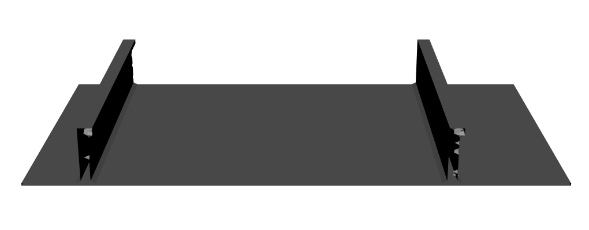
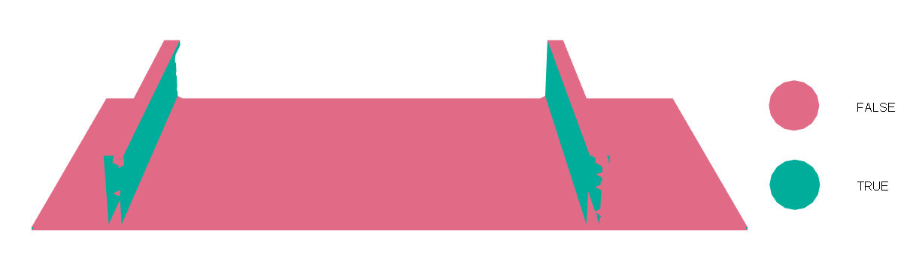
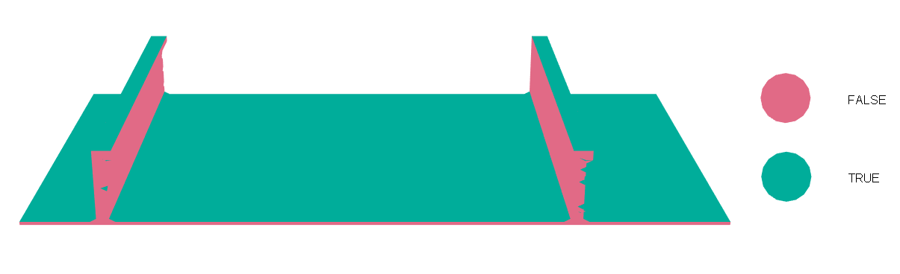
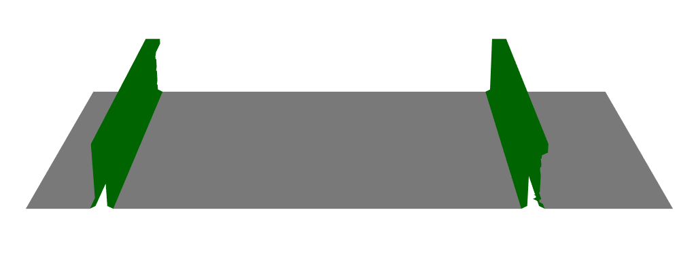
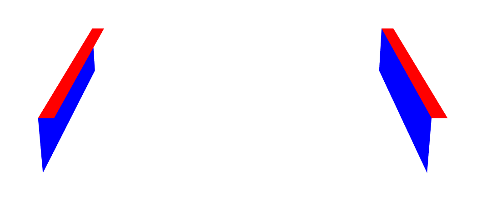

```{r message=FALSE, warning=FALSE, include=FALSE}
knitr::opts_chunk$set(
  collapse = TRUE,
  comment = "##",
  fig.dim = c(6, 5), 
  fig.align = "center"
)
library(rgl)
setupKnitr(autoprint = TRUE)
```

## Introduction

`dimControl` provides tools for the geometric processing of three-dimensional point
clouds and triangular meshes, with particular application to dimensional inspection.

This vignette illustrates a reproducible workflow for the processing of 3D geometric
data using a reference CAD model included in the package as an example. A synthetic
point cloud is first generated from the reference geometry to reproduce a simplified
3D scanning scenario. The object points are then separated from the supporting floor
and used to reconstruct a triangular surface.

The reconstructed mesh is subsequently processed to identify and classify relevant
geometric components according to their characteristics. Finally, the boundary of the
object is extracted, cleaned, ordered, and segmented.

The workflow therefore covers:

- Simulation and segmentation of a 3D point cloud.
- Reconstruction of a surface from a point cloud.
- Identification and classification of geometric components.
- Extraction, cleaning, and segmentation of boundaries.

```{r setup}
library(dimControl)
```

The 3D visualizations in this vignette are generated using the [`rgl`](https://dmurdoch.github.io/rgl/), together with the [`legendplot`](https://rubenfcasal.github.io/legendplot/) to add 
legends to the graphical representations.

```{r message=FALSE}
library(rgl)
library(legendplot)
library(Rvcg)
library(FNN)
```

The `legendplot::new3d()` function can be used to initialize or reset the 3D display.

## Reference geometry

A dimensional control workflow may include a reference geometry, such as a theoretical
CAD model, when one is available. However, a reference CAD model is not required to use
the geometric processing and measurement tools provided by `dimControl`.

When available, a CAD model can provide the theoretical reference geometry for dimensional 
measurements and can subsequently be compared with the corresponding geometry reconstructed 
from the inspected object.

In this vignette, the CAD model included in `dimControl` is used as an example to
illustrate the workflow.

```{r show-cad}
# Represent the CAD model
# Use `open3d()` or `new3d()` to open a new device
shade3d(cad, col = "lightgray")
```

## Simulating a 3D point cloud from the CAD model

In a real dimensional inspection workflow, the geometry of the inspected object can be
acquired using a 3D scanning system, producing a point cloud that represents the measured
surface. Depending on the acquisition conditions, the resulting point cloud may also
contain points belonging to the surrounding environment.

For this reproducible example, a synthetic point cloud is generated from the reference
geometry using `simulateCloud()`. The simulated data contain points representing both
the object and the supporting floor, reproducing a simplified 3D scanning scenario.

```{r simulate-cloud}
set.seed(123)
cloud <- simulateCloud(mesh = cad, n = 1e5, floor = list(n = 5e3, gap = 2, margin = 20))
head(cloud)
```

## Separating object and floor points

In dimensional inspection based on 3D scanning, the acquired point cloud may contain
both the object of interest and surrounding elements, such as the supporting floor.
Separating these components is therefore an important preprocessing step before surface
reconstruction and dimensional analysis.

When the object and the floor occupy different levels along the vertical coordinate,
their separation can be approached by analysing the distribution of the Z coordinate.
The `findModes()` function identifies modes and valleys in this distribution and can be
used to determine a suitable threshold between both components.

In the present vignette, this approach is illustrated using the simulated point cloud.

```{r find-modes}
modesZ <- findModes(x = cloud[, 3], bw = 0.01, q1 = 0.97)
modesZ
```

```{r segment-cloud}
component <- factor(cloud[, 3] > modesZ[1, 2], levels = c(FALSE, TRUE),
                    labels = c("floor", "object"))
table(component)
```
 
The resulting factor identifies the component associated with each point in `cloud`.
The segmented point cloud is represented below. Object points are shown in dark gray,
whereas floor points are shown in red.
 
```{r show-segmentation}
# Represent the simulated point cloud
# Use `open3d()` or `new3d()` to open a new device
points3d(cloud[component == "object", ], lit = TRUE, color = "darkgray")
points3d(cloud[component == "floor", ], lit = TRUE, color = "red")
```

The visualization shows the separation between the simulated object and the supporting
floor. The object points are retained for the subsequent surface reconstruction.

## Reconstructing the panel surface

After separating the object from the supporting floor, the object point cloud is used
to reconstruct a continuous triangular surface. The `createMesh()` function performs
linear binning of the point cloud and subsequently extracts the surface using the
Marching Cubes algorithm.

In this example, the reference CAD model is provided through the `meshCad` argument.
Its dimensions are used as a reference for the spatial coverage of the reconstructed
surface. In addition, `zeroBorder = TRUE` adds zero-valued layers at the boundaries
of the binning grid in the X and Z directions. These layers facilitate the closure
of the isosurface during the Marching Cubes reconstruction.

```{r create-mesh}
object <- cloud[component == "object", ]
objectMesh <- createMesh(cloud = object, resolNbin = c(8, 8, 4), kFactor = 1e-2,
                        truncFactor = 3, meshCad = cad, zeroBorder = TRUE)
mesh <- objectMesh$mesh
```

The resulting triangular mesh represents the reconstructed surface of the object.

```{r show-reconstructed-mesh-code, eval=FALSE}
# Represent the reconstructed object surface
# Use `open3d()` or `new3d()` to open a new device
shade3d(mesh, col = "lightgray")
```

```{r show-reconstructed-mesh-image, echo=FALSE, out.width="80%"}

# rgl::snapshot3d(filename = "vignettes/reconstructed-mesh.png")
```

## Classification of object components

The reconstructed mesh can be further processed to identify relevant geometric components 
according to the characteristics of the object under study. In this example, the object 
contains a base and several reinforcements, which are identified according to the 
orientation and spatial distribution of the triangular faces.

Face normals and barycentres are first computed for each triangle. The orientation of
each face is characterized by the angles between its normal vector and the X and Z axes.

```{r classify-mesh-orientation}
# Compute face normals and barycentres
normals <- vcgFaceNormals(mesh)
bary <- vcgBary(mesh)

# Compute angles relative to the X and Z axes
angleX <- angleAxis(v = normals, dim = 1, negative = TRUE)
angleZ <- angleAxis(v = normals, dim = 3)

# Angular tolerances
tolAngleX <- 60
tolAngleZ <- 40

# Identify vertical and horizontal faces
isVertical <- angleX < tolAngleX | angleX > (180 - tolAngleX)
isHorizontal <- angleZ < tolAngleZ

# Identify faces belonging to the object base
tolZ <- 5
isBase <- isHorizontal & bary[, 3] < tolZ
```

The orientation-based classification can be represented directly on the reconstructed
mesh. The following representations show how the angular criteria identify approximately
vertical faces, approximately horizontal faces, and the faces associated with the
object base.

```{r show-vertical-faces-code, eval=FALSE}
# Represent vertical faces
fshade3d(mesh, as.factor(isVertical), lit = FALSE)
```

```{r show-vertical-faces-image, echo=FALSE, out.width="95%", fig.align="center"}

# # Vertical faces
# legendplot::fshade3d(mesh, as.factor(isVertical), lit = FALSE)
# rgl::snapshot3d(filename = file.path(normalizePath("vignettes", winslash = "/", mustWork = TRUE),
#     "vertical-faces.png"), webshot = FALSE)
```

```{r show-horizontal-faces-code, eval=FALSE}
# Represent horizontal faces
fshade3d(mesh, as.factor(isHorizontal), lit = FALSE)
```

```{r show-horizontal-faces-image, echo=FALSE, out.width="100%", fig.align="center"}

# # Horizontal faces
# legendplot::fshade3d(mesh, as.factor(isHorizontal), lit = FALSE)
# rgl::snapshot3d(filename = file.path(normalizePath("vignettes", winslash = "/", mustWork = TRUE),
#     "horizontal-faces.png"), webshot = FALSE)
```

```{r show-base-faces-code, eval=FALSE}
# Represent object-base faces
fshade3d(mesh, as.factor(isBase), lit = FALSE)
```

```{r show-base-faces-image, echo=FALSE, out.width="100%", fig.align="center"}
knitr::include_graphics("base-faces.png")
# # Represent object-base faces
# legendplot::fshade3d(mesh, as.factor(isBase), lit = FALSE)
# rgl::snapshot3d(filename = file.path(normalizePath("vignettes", winslash = "/", mustWork = TRUE),
#     "base-faces.png"), webshot = FALSE)
```

The reinforcements are identified from the spatial distribution of the barycentres of
approximately vertical faces along the X direction. The modes of this distribution
define the X intervals associated with the individual reinforcements.

```{r identify-reinforcements}
# Identify the X ranges associated with the reinforcements
modesX <- findModes(x = bary[isVertical, 1], bw = 8, q1 = 0.97)

# Number of detected reinforcements
nReinforcements <- nrow(modesX)
nReinforcements
```
A separate mesh is then extracted for each reinforcement. Connected triangle components 
are identified with `splitTrianglesInd()`, and small isolated components are removed 
with `filterMeshComponents()`.

```{r create-reinforcement-meshes}
reinforcementMesh <- vector("list", nReinforcements)
reinforcementInd <- vector("list", nReinforcements)
for (i in seq_len(nReinforcements)) {
  # Select triangles within the X range of the current reinforcement
  ind <- bary[, 1] > modesX[i, 1] & bary[, 1] < modesX[i, 2] & 
        (isVertical | bary[, 3] > tolZ)

  # Create the candidate reinforcement mesh
  candidateMesh <- mesh
  candidateMesh$it <- mesh$it[, ind]

  # Identify connected triangle components
  components <- splitTrianglesInd(mesh = candidateMesh)

  # Remove small disconnected components
  filtered <- filterMeshComponents(mesh = candidateMesh, comps = components, 
                                   minSize = 1000)
  
  # Store triangle indices in the original mesh
  reinforcementInd[[i]] <- which(ind)[filtered$triIdx]
  
  # Store the filtered reinforcement mesh
  reinforcementMesh[[i]] <- filtered$mesh
}
```

The object base is extracted using the same connected-component filtering procedure.

```{r create-base-mesh}
# Create the candidate base mesh
baseMesh <- mesh
baseMesh$it <- mesh$it[, isBase]

# Identify connected triangle components
components <- splitTrianglesInd(mesh = baseMesh)

# Remove small disconnected components
filtered <- filterMeshComponents(mesh = baseMesh, comps = components, minSize = 1000)

# Store the filtered base mesh
baseMesh <- filtered$mesh

# Store triangle indices in the original mesh
baseInd <- which(isBase)[filtered$triIdx]
```

The resulting `baseMesh` object contains the object base, while `reinforcementMesh`
contains the individual reinforcements. The vectors `baseInd` and `reinforcementInd`
retain their corresponding triangle indices in the original reconstructed mesh. The
classified structural components are represented together below.

```{r show-object-components-code, eval=FALSE}
# Represent the object base and reinforcements
# Use `open3d()` or `new3d()` to open a new device

# Represent the object base
shade3d(baseMesh, col = "lightgray")

# Represent the reinforcements
for (i in seq_len(nReinforcements)) {
  shade3d(reinforcementMesh[[i]], col = "darkgreen", lit = FALSE)
}
```

```{r show-object-components-image, echo=FALSE, out.width="80%"}

# rgl::snapshot3d(filename = "vignettes/object-components.png")
```

## Classification of reinforcement surfaces

Each reinforcement is further classified into its main surfaces. The bulb orientation
is first determined with `sideBulb()`. Face normals and their angles relative to the
X and Z axes are then used to identify the flat face of the reinforcement and the upper
flat face of its bulb.

```{r classify-reinforcement-surfaces}
# Determine the bulb orientation of each reinforcement
# TRUE = left, FALSE = right
bulbSide <- sapply(reinforcementMesh, sideBulb)
bulbSide

# Angular tolerance for the flat faces
tolAngleZFlat <- 60

reinforcementFlatMesh <- vector("list", nReinforcements)
bulbUpperMesh <- vector("list", nReinforcements)
for (i in seq_len(nReinforcements)) {
  # Compute face normals and barycentres
  normals <- vcgFaceNormals(reinforcementMesh[[i]])
  bary <- vcgBary(reinforcementMesh[[i]])

  # Compute angles relative to the X and Z axes
  angleX <- angleAxis(v = normals, dim = 1, negative = TRUE)
  angleZ <- angleAxis(v = normals, dim = 3)

  # Identify the flat face according to the bulb orientation
  if (bulbSide[i]) {
    isFlatFace <- angleX >= (180 - tolAngleX)
  } else {
    isFlatFace <- angleX < tolAngleX
  }

  isFlatFace <- isFlatFace & angleZ >= tolAngleZFlat

  # Create the candidate flat-face mesh
  candidateFlatMesh <- reinforcementMesh[[i]]
  candidateFlatMesh$it <- candidateFlatMesh$it[, isFlatFace]

  # Identify connected components
  components <- splitTrianglesInd(mesh = candidateFlatMesh)

  # Remove small disconnected components
  filtered <- filterMeshComponents(mesh = candidateFlatMesh, comps = components, 
                                   minSize = 2000)

  # Store the flat face of the reinforcement
  reinforcementFlatMesh[[i]] <- filtered$mesh

  # Determine the upper Z region of the reinforcement
  zLimit <- quantile(bary[, 3], probs = 0.8)

  # Identify the upper flat face of the bulb
  isBulbUpperFace <- angleZ <= tolAngleZ & bary[, 3] >= (zLimit + 5)

  ## Create the upper flat face of the bulb mesh
  bulbUpperMesh[[i]] <- reinforcementMesh[[i]]
  bulbUpperMesh[[i]]$it <- bulbUpperMesh[[i]]$it[ , isBulbUpperFace]
}
```

The resulting meshes identify two relevant surfaces of each reinforcement: the flat
face of the reinforcement and the upper flat face of its bulb. The bulb orientation
determined by `sideBulb()` is used to select the appropriate flat face of each reinforcement.

The classified surfaces of all reinforcements are represented together below.

```{r show-reinforcement-surfaces-code, eval=FALSE}
# Represent the classified reinforcement surfaces
# Use `open3d()` or `new3d()` to open a new device
for (i in seq_len(nReinforcements)) {
  shade3d(reinforcementFlatMesh[[i]], col = "blue", lit = FALSE)
  shade3d(bulbUpperMesh[[i]], col = "red", lit = FALSE)
}
```

```{r show-reinforcement-surfaces-image, echo=FALSE, out.width="100%"}

# rgl::snapshot3d(filename = "vignettes/reinforcement-surfaces.png")
```

## Extraction of the object base boundary

The boundary of the object base provides geometric information that can be used for
subsequent dimensional analysis, including the identification of its corners and the
determination of the corresponding base dimensions.

Boundary edges are first extracted from `baseMesh` using `getBoundarySegments()`. Before
cleaning the boundary, the vertices shared by the base and each reinforcement are identified
from their triangle indices in the reconstructed mesh. These intersection vertices are
provided to `cleanBoundarySegments()` to remove the corresponding boundary segments and
reconnect the resulting gaps. Finally, `sortSegments()` is used to arrange the boundary
segments into a continuous sequence along the object contour.

```{r extract-base-boundary}
# Identify indices of vertices shared by the base and each reinforcement
baseReinforcementIntersection <- vector("list", nReinforcements)
for (i in seq_len(nReinforcements)) {
  baseReinforcementIntersection[[i]] <- intersect(
    mesh$it[, baseInd], mesh$it[, reinforcementInd[[i]]])
}

# Extract the original boundary segments
boundaryRaw <- getBoundarySegments(mesh = baseMesh, returnMesh = FALSE, 
                                   simplify = FALSE)

# Clean and reconnect the boundary segments
boundaryClean <- cleanBoundarySegments(iBorder = boundaryRaw, baseMesh = baseMesh, 
                                       intersection = baseReinforcementIntersection)

# Order the cleaned segments along the boundary
boundary <- sortSegments(edges = boundaryClean)
```

The resulting `boundary` matrix contains the boundary segments cleaned and ordered
according to their connectivity. Having a cleaned and ordered boundary facilitates the
identification of different sections of the object contour, since the position of each
segment within the sequence can be used to define and extract the corresponding contour
sections.

In this example, the object base is approximately rectangular and aligned with the X
and Y axes. Therefore, its four corners can be identified from the extreme combinations
of the X and Y coordinates. Corner A corresponds to low X and Y coordinates, B to high
X and low Y, C to high X and Y, and D to low X and high Y.

```{r identify-base-corners}
# Obtain the ordered boundary vertex indices in baseMesh
boundaryVertices <- c(boundary[1, 1], boundary[2, ])

# Extract their XY coordinates
boundaryXY <- t(baseMesh$vb[1:2, boundaryVertices])

# Obtain the XY coordinate limits
minX <- min(boundaryXY[, 1])
maxX <- max(boundaryXY[, 1])
minY <- min(boundaryXY[, 2])
maxY <- max(boundaryXY[, 2])

# Identify the four corners of the rectangular object base
corners <- rbind(
  A = c(minX, minY),
  B = c(maxX, minY),
  C = c(maxX, maxY),
  D = c(minX, maxY)
)

# Find the positions of the four corners along the ordered boundary
cornerPos <- get.knnx(boundaryXY, corners, k = 1)$nn.index[, 1]

# Obtain the corresponding vertex indices in baseMesh
cornerVertices <- boundaryVertices[cornerPos]
```

The vector `cornerPos` contains the positions of the four detected corners within the
ordered boundary sequence, whereas `cornerVertices` contains their corresponding vertex
indices in `baseMesh`. The corner positions can therefore be used to divide the ordered
boundary into the four sides of the object base.

```{r segment-base-boundary}
# Order the corner positions along the boundary
cornerPos <- sort(cornerPos)
n <- ncol(boundary)

# Define the four boundary sections
sideLimits <- list(
  cornerPos[1]:(cornerPos[2] - 1),
  cornerPos[2]:(cornerPos[3] - 1),
  cornerPos[3]:(cornerPos[4] - 1),
  c(cornerPos[4]:n, seq_len(cornerPos[1] - 1))
)

# Extract the four boundary sections
boundarySides <- lapply(sideLimits, function(ind) boundary[, ind])
```

The three representations below illustrate the boundary processing. From left to right,
they show the original boundary extracted from the base mesh, the cleaned and ordered
boundary with the detected corners, and the final boundary divided into four sections.

```{r show-base-boundary-code, eval=FALSE}
# Represent the original boundary, the detected corners, and the segmented boundary
# Use `open3d()` or `new3d()` to open a new device
mfrow3d(1, 3)

# Represent the original boundary
shade3d(baseMesh, col = "lightgray", alpha = 0.4)
shade3d(mesh3d(vertices = baseMesh$vb, segments = boundaryRaw), col = "red")

# Represent the cleaned and ordered boundary with the detected corners
next3d()
shade3d(baseMesh, col = "lightgray", alpha = 0.4)
shade3d(mesh3d(vertices = baseMesh$vb, segments = boundary), col = "red")
points3d(t(baseMesh$vb[1:3, cornerVertices]), size = 8)

# Represent the four segmented boundary sections
next3d()
shade3d(baseMesh, col = "lightgray", alpha = 0.4)
color <- c("red", "blue", "green", "orange")
for (i in seq_len(4)) {
  shade3d(mesh3d(vertices = baseMesh$vb, segments = boundarySides[[i]]), 
               col = color[i], lwd = 2)
  }
```

```{r show-base-boundary-image, echo=FALSE, out.width="100%"}
knitr::include_graphics("base-boundary.png")
# rgl::snapshot3d(filename = "vignettes/base-boundary.png")
```

## Further help

See the function [reference pages](https://modes-cemi.github.io/dimControl/reference/) for the full list of arguments and additional examples.
